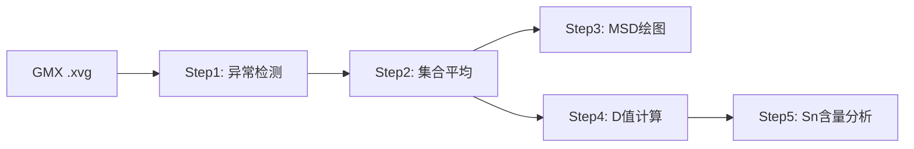
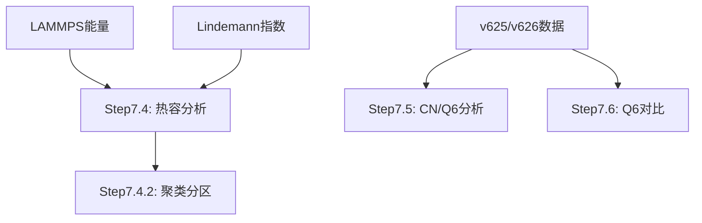

# PtSnO 纳米团簇分析工作流

> 完整的扩散与结构分析流程集合  
> 创建日期: 2025-11-06  
> 数据分析: Pt-Sn-O纳米团簇的扩散行为与结构演化

---

## 📁 文件结构

```
workflow/
├── README.md                                          # 本文件（总体说明）
├── STEP7_DATA_SOURCE_GUIDE.md                         # Step 7系列详细指南
│
├── ========== Step 1-5: MSD扩散分析流程 ==========
├── step1_detect_outliers.py                           # 异常run检测
├── step2_ensemble_analysis.py                         # 集合平均分析
├── step3_plot_msd.py                                  # MSD曲线绘制
├── step4_calculate_ensemble_D.py                      # 扩散系数计算
├── step5_analyze_sn_content.py                        # Sn含量影响分析
│
├── ========== Step 6: 能量与热容分析 ==========
├── step6_energy_analysis_v2.py                        # LAMMPS能量分析（含载体）
├── step6.2analyze_cv_series.py                        # Cv系列专项分析
├── step6_3_adaptive_regional_heat_capacity.py         # 自适应区域热容
├── step5.9calculate_support_heat_capacity.py          # 载体热容计算
├── subtract_support_v2.py                             # 扣除载体热容工具
│
├── ========== Step 7: Lindemann指数与结构分析 ==========
├── step7_lindemann_analysis.py                        # Lindemann指数分析
├── step7_4_multi_system_heat_capacity.py              # 多体系热容（基础数据）
├── step7_4_2_clustering_analysis.py                   # 聚类相态分区
│
├── ========== Step 7.5/7.6: 结构演化分析 ==========
├── v625_data_locator.py                               # 数据定位工具
├── step7-5-unified_multi_temp_v626_analysis.py        # 配位数/Q6综合分析
├── step7-6-1_temp_side_by_side_comparison.py          # 温度并排对比
├── step7-6-2_individual_system_temp_comparison.py     # 单系统多温度对比
└── step7-6-3_q6_stats_comparison.py                   # Q6统计对比
```

---

## 🎯 快速导航

### **扩散分析流程** (Step 1-5)



**数据源**: GROMACS输出的 `.xvg` 文件 (9,659个)  
**目标**: 计算扩散系数D → 分析激活能 → Sn含量效应

### **结构分析流程** (Step 7)



**数据源**: LAMMPS能量 + Lindemann指数 + 配位数时间序列  
**目标**: 相态分区 → 局域结构 → 时间演化

---

## 📊 两大分析体系对比

| 维度 | **Step 1-5** (扩散分析) | **Step 7** (结构分析) |
|------|------------------------|----------------------|
| **核心物理量** | 扩散系数 D | Lindemann指数 δ, Q6参数 |
| **数据来源** | GROMACS MSD | LAMMPS能量 + 配位数 |
| **文件格式** | .xvg | .csv |
| **分析目标** | 原子迁移速率 | 相态转变 + 局域结构 |
| **输出典型** | D vs T (Arrhenius图) | δ vs T (相图) |
| **相互关系** | 独立并行 | 可关联（D值可用于Step7.4.2聚类） |

---

## 🚀 使用指南

### Step 1-5: MSD扩散分析

#### 1️⃣ Step 1: 检测异常run

```bash
python step1_detect_outliers.py
```

**作用**:
- 提取GMX D值（从.xvg注释）
- 使用IQR/3σ/MAD方法检测异常
- 生成 `large_D_outliers.csv`

**输出**:
- `results/large_D_outliers.csv` - 异常run清单
- `results/ensemble_comparison.csv` - 改进前后对比

---

#### 2️⃣ Step 2: 集合平均分析

```bash
python step2_ensemble_analysis.py
```

**作用**:
- 舍弃异常run后重新集合平均
- Intercept + D值二次筛选
- 生成高质量MSD数据

**输出**:
- `results/ensemble_analysis_results.csv` - 筛选后数据
- `results/statistics_by_element.csv` - 元素统计

---

#### 3️⃣ Step 3: MSD曲线绘制

```bash
python step3_plot_msd.py
```

**作用**:
- 绘制集合平均MSD曲线
- 叠加单次run（半透明）
- 标注异常run

**输出**:
- `results/msd_curves/*.png` - MSD曲线图

---

#### 4️⃣ Step 4: 扩散系数计算

```bash
python step4_calculate_ensemble_D.py
```

**作用**:
- 从集合平均MSD重新拟合D值
- 计算误差和置信区间
- 生成D值数据库

**输出**:
- `results/ensemble_D_analysis/ensemble_D_values.csv` - D值数据

---

#### 5️⃣ Step 5: Sn含量影响分析

```bash
python step5_analyze_sn_content.py
```

**作用**:
- D vs Sn含量
- D vs 温度（不同Sn含量）
- Arrhenius分析 + 活化能计算

**输出**:
- `results/sn_content_analysis/` - 系列分析图表

---

### Step 6: 能量与热容分析

#### 6.1 LAMMPS能量分析

```bash
python step6_energy_analysis_v2.py
```

**作用**:
- 分析LAMMPS总能量（团簇 + 载体）
- 计算总热容 Cv_total = dE/dT
- **⚠️ 重要**: 输出包含载体（240个Al₂O₃原子）的贡献

**输入**:
- `files/lammps_energy_analysis/energy_master_*.csv`

**输出**:
- `results/step6_energy/` - 能量分析结果
- `Cv_total_meV_K` - 总热容（含载体，单位: meV/K）

**关键问题**: 载体热容未知！
- 需要单独模拟纯Al₂O₃体系确定 Cv_support
- 或使用估计值（~18-21 meV/K）

---

#### 6.2 扣除载体热容

```bash
# 估计并扣除载体热容
python subtract_support_v2.py

# 计算载体热容（需单独模拟数据）
python step5.9calculate_support_heat_capacity.py
```

**作用**:
- 从总热容中扣除载体贡献
- 得到纯团簇热容 Cv_cluster

**公式**:
```
Cv_cluster = Cv_total - Cv_support
```

---

#### 6.3 Cv系列分析

```bash
# Cv系列专项分析
python step6.2analyze_cv_series.py

# 自适应区域热容分析
python step6_3_adaptive_regional_heat_capacity.py
```

**作用**:
- Cv-1到Cv-5系列的对比分析
- 自适应检测相变区间
- 区域热容计算

---

### Step 7: Lindemann指数分析

```bash
# 默认模式（使用MSD异常筛选）
python step7_lindemann_analysis.py

# 不筛选模式（分析所有数据）
python step7_lindemann_analysis.py --no-filter
```

**作用**:
- 分析Lindemann指数 δ（原子振动幅度）
- 相态判定: δ < 0.1 (固态), δ ≥ 0.1 (液态)
- 熔化温度识别
- 4级路径签名精确匹配

**输入**:
- `files/lindemann_*/lindemann_index_*.csv`
- `results/large_D_outliers.csv` (可选，用于筛选)

**输出**:
- `results/step7_lindemann/` - Lindemann分析结果
- δ vs T 曲线
- 熔化温度统计
- 相图热力图

---

### Step 7.4: 热容与相态分析

#### 1️⃣ 生成基础数据

```bash
python step7_4_multi_system_heat_capacity.py
```

**作用**:
- 合并LAMMPS能量 + Lindemann指数
- 生成51个结构的完整数据集
- 计算热容Cv

**输入**:
- `files/lammps_energy_analysis/energy_master_*.csv`
- `files/lindemann_*/lindemann_index_*.csv`

**输出**:
- `results/step7_4_multi_system/step7_4_all_systems_data.csv`

---

#### 2️⃣ 聚类相态分区

```bash
# 基础2D聚类
python step7_4_2_clustering_analysis.py --structure pt6sn8 --n-partitions 3

# 3D聚类（加入能量）
python step7_4_2_clustering_analysis.py --structure pt6sn8 --n-partitions 3 --use-energy

# 4D聚类（温度+δ+能量+D值）
python step7_4_2_clustering_analysis.py --structure pt6sn8 --n-partitions 3 --use-energy --use-d-value

# 自动确定最优分区数
python step7_4_2_clustering_analysis.py --structure pt6sn8 --auto-partition --use-energy

# 批量分析所有结构
python step7_4_2_clustering_analysis.py --structure all --auto-partition --use-energy
```

**作用**:
- 自动检测相边界（替代固定0.1/0.15阈值）
- K-means/层次聚类/DBSCAN
- 多维特征空间优化

**输出**:
- `results/step7_4_2_clustering/` - 聚类结果 + 可视化

---

### Step 7.5: 配位数与Q6结构分析

```bash
# 分析Pt8Snx系列
python step7-5-unified_multi_temp_v626_analysis.py --series Pt8Snx

# 分析PtxSn8-x系列
python step7-5-unified_multi_temp_v626_analysis.py --series PtxSn8-x

# 分析Pt6Snx系列
python step7-5-unified_multi_temp_v626_analysis.py --series Pt6Snx

# 分析所有系列
python step7-5-unified_multi_temp_v626_analysis.py --all
```

**作用**:
- 自动检测v625/v626数据格式
- 4-8次重复运行平均
- 配位数 + Q6 + δ 综合分析
- 键类型统计（Pt-Pt, Pt-Sn, Sn-Sn）

**数据源**: `coordination_time_series_results_sample_*/`

**输出**:
- 综合图 (3×10网格)
- 热图 (键类型统计)
- Q6对比图

---

### Step 7.6: Q6时间演化对比

#### 7.6.1 温度并排对比

```bash
python step7-6-1_temp_side_by_side_comparison.py \
    --series Pt8Snx \
    --temps 300K,900K \
    --systems pt8sn1-2-best,pt8sn2-1-best,pt8sn3-1-best
```

**输出**: 并排时间序列图（左300K，右900K）

---

#### 7.6.2 单系统多温度对比

```bash
python step7-6-2_individual_system_temp_comparison.py \
    --series Pt8Snx \
    --system pt8sn5-1-best \
    --temps 300K,500K,700K,900K
```

**输出**: 单系统多温度叠加图

---

#### 7.6.3 Q6统计对比

```bash
python step7-6-3_q6_stats_comparison.py \
    --series Pt8Snx \
    --temps 300K,500K,700K,900K
```

**输出**: Q6统计表格 + 箱线图 + 趋势图

---

## 📂 数据依赖关系

### Step 1-5 依赖链

```
GMX .xvg文件 (原始数据)
    ↓
Step1 → large_D_outliers.csv
    ↓
Step2 → ensemble_analysis_results.csv
    ↓
Step3 (绘图) + Step4 (D值计算)
    ↓
Step5 (Sn含量分析)
```

### Step 7.4 依赖链

```
LAMMPS能量 + Lindemann指数 (原始数据)
    ↓
Step7.4 → step7_4_all_systems_data.csv
    ↓
Step7.4.2 (聚类) ← (可选) ensemble_analysis_results.csv
```

### Step 7.5/7.6 依赖链

```
v625/v626数据 (独立数据源)
    ↓
v625_data_locator (定位工具)
    ↓
Step7.5 (综合分析) + Step7.6 (专项对比)
```

---

## ⚙️ 环境配置

### Python依赖

```bash
conda activate base  # 或您的环境

# 必需包
pip install pandas numpy scipy matplotlib

# Step 7.4.2 额外依赖
pip install scikit-learn seaborn

# 可选（更好的进度条）
pip install tqdm
```

### 目录结构要求

```
v3_simplified_workflow/
├── scripts/           # 脚本文件
├── results/           # 输出目录（自动创建）
├── files/             # 输入数据
│   ├── lammps_energy_analysis/
│   └── lindemann_*/
└── coordination_time_series_results_sample_*/  # v625/v626数据
```

---

## 📍 原始数据位置

### Step 1-5 数据源

**GMX .xvg文件** (9,659个):

```
d:/OneDrive/py/Cv/lin/MSD_Analysis_Collection/test-unwrap-new/file/
├── collected_gmx_msd/                    (5,910个文件)
└── gmx_msd_results_20251015_184626_collected/  (3,749个文件)
```

**文件格式**: `T1000.r24.gpu0_msd_Pt.xvg`

### Step 7.4 数据源

**LAMMPS能量**:
```
files/lammps_energy_analysis/
├── energy_master_*.csv
└── sup/energy_master_*.csv
```

**Lindemann指数**:
```
files/lindemann_*/
└── lindemann_index_*.csv
```

### Step 7.5/7.6 数据源

**v625/v626数据**:
```
coordination_time_series_results_sample_*/
└── dp-md/4090-ustc/more/
    ├── Pt8/
    ├── Pt8-2/
    ├── Pt8-3/
    └── ...
```

**详细说明**: 见 `STEP7_DATA_SOURCE_GUIDE.md`

---

## 🔍 常见问题

### Q1: Step 7.4.2 提示找不到数据文件？

**A**: 必须先运行 Step 7.4 生成基础数据：

```bash
python step7_4_multi_system_heat_capacity.py
python step7_4_2_clustering_analysis.py --structure pt6sn8
```

### Q2: Step 2 如何调整筛选阈值？

**A**: 编辑 `step2_ensemble_analysis.py` 中的参数：

```python
INTERCEPT_MAX = 20.0     # Intercept阈值 (A²)
D_MAX_THRESHOLD = 0.1    # D值上限 (cm²/s)
```

### Q3: 如何只分析特定系统？

**A**: 修改脚本中的 `SYSTEM_FILTER`:

```python
SYSTEM_FILTER = {
    'include_patterns': [r'^pt8'],  # 只分析pt8开头的系统
    'exclude_patterns': [r'^[Oo]\d+']  # 排除含氧系统
}
```

### Q4: v625和v626数据有什么区别？

**A**: 
- **v625**: 单次运行 (`300K/`)
- **v626**: 多次运行 (`T300.r3.gpu0/`, `T300.r4.gpu0/`)
- 脚本会自动检测格式，优先使用v626

### Q5: 如何确认数据已正确加载？

**A**: 检查脚本输出的统计信息：

```
[V625DataLocator] 初始化完成
[Pt8] 找到8个运行文件夹:
  1. dp-md/4090-ustc/more/Pt8
  2. dp-md/4090-ustc/more/Pt8-2
  ...
```

---

## 📈 典型分析流程

### 完整扩散分析（推荐顺序）

```bash
# 1. 检测异常
python step1_detect_outliers.py

# 2. 集合平均
python step2_ensemble_analysis.py

# 3. 绘制MSD曲线
python step3_plot_msd.py

# 4. 计算D值
python step4_calculate_ensemble_D.py

# 5. Sn含量分析
python step5_analyze_sn_content.py
```

### 完整结构分析（推荐顺序）

```bash
# 1. 生成Step7.4基础数据
python step7_4_multi_system_heat_capacity.py

# 2. 相态聚类分析
python step7_4_2_clustering_analysis.py --structure all --auto-partition --use-energy

# 3. 配位数/Q6综合分析
python step7-5-unified_multi_temp_v626_analysis.py --all

# 4. Q6专项对比（可选）
python step7-6-1_temp_side_by_side_comparison.py --series Pt8Snx --temps 300K,900K
```

### 快速诊断单个系统

```bash
# 检查pt6sn8的扩散和结构
python step4_calculate_ensemble_D.py  # 获取D值
python step7_4_2_clustering_analysis.py --structure pt6sn8 --auto-partition --use-energy
python step7-5-unified_multi_temp_v626_analysis.py --series Pt6Snx
```

---

## 📚 相关文档

- **STEP7_DATA_SOURCE_GUIDE.md** - Step 7系列详细数据源指南
- **脚本内文档字符串** - 每个脚本开头的详细说明

---

## 🔄 版本历史

| 日期 | 版本 | 更新内容 |
|------|------|---------|
| 2025-11-06 | v1.0 | 创建workflow文件夹和完整README |
| 2025-10-27 | - | Step 7.6系列脚本开发 |
| 2025-10-26 | - | v626数据格式支持 + v625_data_locator |
| 2025-10-22 | - | Step 7.4.2聚类分析功能 |
| 2025-10-16 | - | Step 1-5基础流程建立 |

---

## 👨‍💻 技术支持

**脚本开发**: GitHub Copilot  
**数据分析**: Pt-Sn-O纳米团簇MD模拟  
**工作流整合**: 2025-11-06

---

## 📝 备注

1. **数据路径**: 所有脚本中的硬编码路径需根据实际情况修改
2. **并行运行**: Step 1-5 和 Step 7 可独立并行运行
3. **数据关联**: Step 7.4.2 可选使用 Step 2 的D值进行聚类
4. **输出目录**: 首次运行会自动创建 `results/` 及子目录

---

**最后更新**: 2025-11-06  
**文件夹位置**: `C:\Users\11207\OneDrive\02_Code\work1-PtSnO\workflow\`
