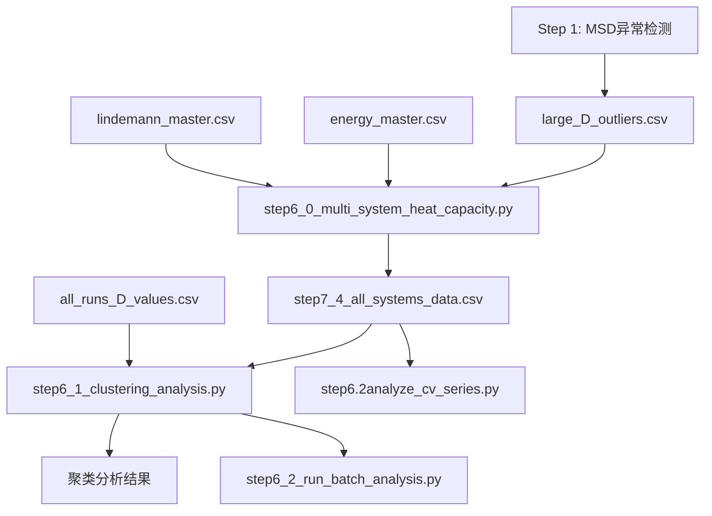

# Step 6 脚本说明文档

## 概述

Step 6 系列脚本用于**多体系热容分析**，结合LAMMPS能量数据和Lindemann指数进行相态分区和热容计算。

---

## step6_0_multi_system_heat_capacity.py

### 功能

多体系单次运行热容分析，结合能量和Lindemann指数进行**三区域热容拟合**（固态/预熔/液态）。

### 前置脚本

- Step 1 (MSD异常检测) → 生成 `large_D_outliers.csv`

### 输入文件

| 文件 | 路径 | 说明 |
|------|------|------|
| 能量数据 | `data/lammps_energy/energy_master_20251016_121110.csv` | LAMMPS总能量（团簇+载体） |
| Lindemann数据 | `data/lindemann/lin-for-all-but-every-ele/lindemann_master_run_20251113_195434.csv` | Pt-Sn距离MSD的Lindemann指数 |
| MSD异常过滤 | `results/large_D_outliers.csv` | 892个路径签名用于过滤异常数据 |
| 载体热容 | `data/lammps_energy/sup/energy_master_20251021_151520.csv` | 可选，默认38.17 meV/K |

### 输出文件

| 文件 | 路径 | 说明 |
|------|------|------|
| 主数据 | `results/step7_4_multi_system/step7_4_all_systems_data.csv` | 合并后的能量-Lindemann数据（3262条） |
| 分析报告 | `results/step7_4_multi_system/step7_4_multi_system_comparison.md` | 多结构热容汇总 |
| 综合对比图 | `results/step7_4_multi_system/step7_4_multi_system_comparison.png` | 6类体系热容对比 |
| 单结构图 | `results/step7_4_multi_system/individual_structure_plots/*.png` | 独立分析图 |

### 路径签名格式

- **3级**: `batch/composition/run_info` (如 `pt8-2/pt8sn5-1-best/t1000.r7.gpu0`)
- **4级**: `runX/parent/composition/run_info` (如 `run3/o1/g-1-o1sn4pt3/t1000.r25.gpu0`)

### 分析内容

1. **相态分类**：基于Lindemann指数
   - 固态：δ < 0.1
   - 预熔：0.1 ≤ δ < 0.15
   - 液态：δ ≥ 0.15
2. **热容拟合**：每个相态区域独立线性拟合 E(T)
3. **体系分类**：自动识别6大类（Cv、Pt6、Pt6SnX、Pt8SnX、PtxSny、PtxSnyOz）

---

## step6_1_clustering_analysis.py

### 功能

Lindemann指数聚类分析，**自动检测相边界**（替代固定0.1/0.15阈值），支持多种聚类算法。

### 版本更新 (v1.6)

- 🔧 **D值匹配策略修复**：使用完整路径签名匹配（保留4级路径）
- ✅ **匹配率**：100% (3262/3262)
- 📝 **路径签名**：与step6_0保持一致，支持3级和4级格式

### 前置脚本

> ⚠️ **必须先运行** `step6_0_multi_system_heat_capacity.py`

### 输入文件

| 文件 | 路径 | 说明 |
|------|------|------|
| 基础数据 | `results/step7_4_multi_system/step7_4_all_systems_data.csv` | step6_0的输出（必需） |
| D值数据 | `results/all_runs_D_values.csv` | 每个run的扩散系数，按路径签名匹配 |
| 载体能量 | `data/lammps_energy/sup/energy_master_20251021_151520.csv` | 可选 |

### D值匹配策略 (v1.6)

```text
主数据 match_key                          D值 filepath 提取签名
─────────────────────────────────────────────────────────────────
3级: pt8-2/pt8sn5-1-best/t1000.r7.gpu0   ← parts[-4]/parts[-3]/run_info
4级: run3/o1/g-1-o1sn4pt3/t1000.r25.gpu0 ← 检测run3后生成4级签名
```

### 输出文件

| 文件 | 路径 | 说明 |
|------|------|------|
| 质量指标 | `results/step7_4_2_clustering/{structure}_quality_metrics.csv` | 聚类质量评分 |
| 分区分析图 | `results/step7_4_2_clustering/{structure}_partition_analysis.png` | 相态分区可视化 |
| 算法对比图 | `results/step7_4_2_clustering/{structure}_algorithm_comparison.png` | K-means vs Hierarchical vs DBSCAN |
| 热容对比图 | `results/step7_4_2_clustering/{structure}_cv_comparison_detailed.png` | 固定阈值 vs 聚类分区热容对比 |
| 策略对比报告 | `results/step7_4_2_clustering/strategy_comparison_report.md` | 分区策略汇总 |
| 算法选择报告 | `results/step7_4_2_clustering/algorithm_selection_report.txt` | 最优算法推荐 |

### 聚类分析内容

1. **聚类算法**：K-means、Hierarchical、DBSCAN
2. **特征空间**：
   - 基础 (2D)：温度 + Lindemann-δ
   - 扩展 (3D)：+ 能量 (`--use-energy`)
   - 扩展 (3D)：+ 扩散系数D (`--use-d-value`)
3. **物理约束**：最大3个分区（固态、预熔、液态）

### 使用示例

```bash
# 基础2D聚类
python step6_1_clustering_analysis.py --structure pt6sn8 --n-partitions 3

# 3D聚类（加入能量）
python step6_1_clustering_analysis.py --structure pt6sn8 --n-partitions 3 --use-energy

# 3D聚类（加入D值，按路径精确匹配）
python step6_1_clustering_analysis.py --structure pt6sn8 --n-partitions 3 --use-d-value

# 批量分析所有结构
python step6_1_clustering_analysis.py --structure all --auto-partition --use-energy
```

---

## step6_2_run_batch_analysis.py

### 功能

批量运行所有Pt-Sn结构的聚类分析（调用step6_1）。

### 分析结构列表

包含48个结构：O2pt4sn6, O2pt7sn7, Pt6sn8, Pt8sn0~Pt8sn10 等。

### 使用示例

```bash
python step6_2_run_batch_analysis.py
```

---

## step6.2analyze_cv_series.py

### 功能

分析Cv系列（Cv-1到Cv-5，Sn8Pt6O4组分）的温度依赖性，用于验证载体热容。

### 分析内容

- Cv-1~Cv-5的能量-温度关系
- 5次重复模拟的统计分析
- 温度间隔50K

---

## 脚本依赖关系



---

## 关键常量

| 常量 | 值 | 说明 |
|------|------|------|
| 载体热容 Cv_support | 38.17 meV/K | CP2K计算，R²=0.999998 |
| 固态阈值 | δ < 0.1 | Lindemann判据 |
| 液态阈值 | δ ≥ 0.15 | Lindemann判据 |

---

*文档更新时间：2025-11-27*
