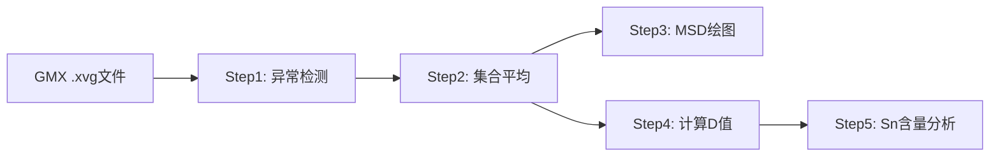
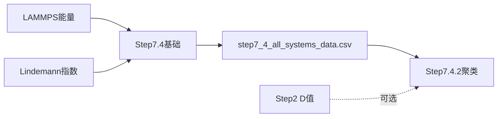
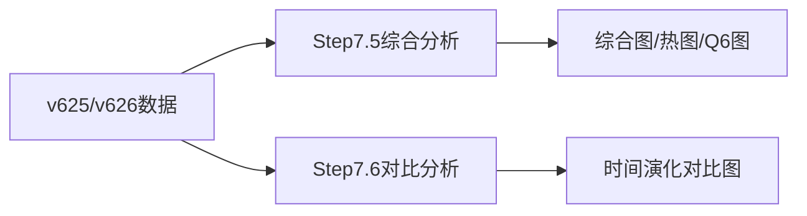

# Step 7 系列数据源完整指南

## 📋 目录

1. [核心概念](#核心概念)
2. [Step 7.4 - 热容与相态分析](#step-74---热容与相态分析)
3. [Step 7.5 - 配位数与Q6结构分析](#step-75---配位数与q6结构分析)
4. [Step 7.6 - Q6时间演化对比](#step-76---q6时间演化对比)
5. [数据流程对比](#数据流程对比)
6. [原始数据文件位置](#原始数据文件位置)

---

## 核心概念

**Step 7系列是结构分析流程，与Step 1-5（扩散分析）并行运行**

### 主要数据类型

| 数据类型 | 符号 | 物理意义 | 单位 |
|---------|------|----------|------|
| **Lindemann指数** | δ | 原子振动幅度，表征相态转变 | 无量纲 |
| **配位数** | CN | 原子近邻数量，表征局域结构 | 个 |
| **Q6参数** | Q6 | 局域结构序参量，区分固/液相 | 无量纲 |
| **LAMMPS能量** | TotEng | 体系总能量（团簇+载体） | eV |

---

## Step 7.4 - 热容与相态分析

### 脚本架构

```
step7_4_multi_system_heat_capacity.py  (基础数据生成器)
    ↓
step7_4_all_systems_data.csv  (中间数据)
    ↓
step7_4_2_clustering_analysis.py  (聚类相态分区)
```

### 7.4.1 基础数据生成器

**脚本**: `step7_4_multi_system_heat_capacity.py`

**输入数据**:
1. **LAMMPS能量文件** 
   - 路径: `files/lammps_energy_analysis/energy_master_*.csv`
   - 字段: `structure`, `temp`, `avg_energy`, `energy_std`, `run_id`
   
2. **Lindemann指数文件**
   - 路径: `files/lindemann_*/lindemann_index_*.csv`
   - 字段: `structure`, `temp`, `delta`, `run_id`

**输出**:
- `results/step7_4_multi_system/step7_4_all_systems_data.csv`
- **统计**: 51个结构 × 多温度 = 2370条记录

**字段说明**:
```python
{
    'match_key': '4级路径签名 (如 run3/o2/o2pt4sn6/t1000.r24.gpu0)',
    'structure': '结构名 (如 Cv, pt8sn0-2-best)',
    'system_type': '系列分类 (Cv, Pt8SnX, PtxSnyOz)',
    'system_id': '细粒度标识',
    'temp': 'LAMMPS温度 (K)',
    'avg_energy': '平均能量 (eV)',
    'energy_std': '能量标准差 (eV)',
    'delta': 'Lindemann指数',
    'phase': '固定阈值分类 (solid/premelting/liquid)',
    'run_id': '运行标识 (如 r15.gpu0)'
}
```

### 7.4.2 聚类相态分区

**脚本**: `step7_4_2_clustering_analysis.py`

**输入数据**:
1. **主数据**: `step7_4_all_systems_data.csv` (必需)
2. **扩散系数**: `ensemble_analysis_results.csv` (可选, 来自Step 2)
3. **载体能量**: `files/lammps_energy_analysis/sup/energy_master_*.csv` (可选)

**聚类特征维度**:
- 基础 (2D): Temperature + Lindemann-δ
- 扩展 (3D): + Energy (`--use-energy`)
- 扩展 (3D): + MSD (`--use-msd`)
- 扩展 (3D): + Diffusion-D (`--use-d-value`)
- 高维 (4D+): 任意组合

**使用示例**:
```bash
# 2D聚类 (温度 + δ)
python step7_4_2_clustering_analysis.py --structure pt6sn8 --n-partitions 3

# 3D聚类 (加入能量)
python step7_4_2_clustering_analysis.py --structure pt6sn8 --n-partitions 3 --use-energy

# 4D聚类 (温度 + δ + 能量 + D值)
python step7_4_2_clustering_analysis.py --structure pt6sn8 --n-partitions 3 --use-energy --use-d-value

# 自动确定最优分区数
python step7_4_2_clustering_analysis.py --structure pt6sn8 --auto-partition --use-energy
```

**输出**:
- `results/step7_4_2_clustering/` (聚类分析结果、可视化图表)

---

## Step 7.5 - 配位数与Q6结构分析

### 核心脚本

| 脚本 | 分析系列 |
|------|---------|
| `step7-5-unified_multi_temp_v626_analysis.py` | 通用（Pt8Snx, PtxSn8-x, Pt6Snx） |
| `step7-5-2pt8snx_multi_temp_v625_analysis.py` | Pt8Snx系列 |
| `step7-5-3ptxsn8x_multi_temp_v625_analysis.py` | PtxSn8-x系列 |
| `step7-5-cv_pt6sn8o4_analysis.py` | Cv/氧化物系列 |

### 数据来源

#### v625数据格式（旧版，单次运行）

**目录结构**:
```
coordination_time_series_results_sample_*/
└── <系列名>/              # 如 Pt8/
    └── <系统名>/          # 如 pt8sn0-2-best/
        └── <温度>/        # 如 300K/
            ├── coordination_time_series.csv
            ├── cluster_global_q6_time_series.csv
            └── bond_type_time_series.csv
```

**示例路径**:
```
Pt8/pt8sn0-2-best/300K/coordination_time_series.csv
```

#### v626数据格式（新版，多次重复运行）

**目录结构**:
```
coordination_time_series_results_sample_*/
└── <系列名>/                      # 如 Pt8/
    └── <系统名>/                  # 如 pt8sn0-2-best/
        ├── T300.r3.gpu0/          # 重复运行1
        │   ├── coordination_time_series.csv
        │   └── cluster_global_q6_time_series.csv
        ├── T300.r4.gpu0/          # 重复运行2
        └── T300.r5.gpu0/          # 重复运行3
```

**示例路径**:
```
Pt8/pt8sn0-2-best/T300.r3.gpu0/coordination_time_series.csv
```

**v626优势**:
- ✅ 支持4-8次重复运行
- ✅ 自动平均提高数据可靠性
- ✅ 可计算标准误差

### 辅助工具: v625_data_locator.py

**功能**: 智能定位分散在多个子目录中的运行文件夹

**典型分散结构**:
```
dp-md/4090-ustc/more/
├── Pt8/          # 主运行
├── Pt8-2/        # 重复运行2
├── Pt8-3/        # 重复运行3
├── Pt8-4/        # 重复运行4
└── ...

dp-md/4090-ustc/GPU-Pt8/  # 其他批次

4090-ustc/more/run3/      # 早期数据
```

**关键功能**:
```python
from v625_data_locator import V625DataLocator

locator = V625DataLocator(base_path)
run_paths = locator.find_all_runs('Pt8')  # 自动查找所有Pt8相关目录
```

### 数据文件内容

#### coordination_time_series.csv

**字段**:
```python
{
    'time': '时间 (ps)',
    'avg_cn_total': '平均总配位数',
    'avg_cn_pt_pt': 'Pt-Pt键平均配位数',
    'avg_cn_pt_sn': 'Pt-Sn键平均配位数',
    'avg_cn_sn_sn': 'Sn-Sn键平均配位数',
    'std_cn_total': '配位数标准差',
    ...
}
```

#### cluster_global_q6_time_series.csv

**字段**:
```python
{
    'time': '时间 (ps)',
    'cluster_metal_q6_global': '全局Q6参数',
    'cluster_metal_q6_std': 'Q6标准差',
    ...
}
```

### 使用示例

```bash
# 分析Pt8Snx系列
python step7-5-unified_multi_temp_v626_analysis.py --series Pt8Snx

# 分析PtxSn8-x系列
python step7-5-unified_multi_temp_v626_analysis.py --series PtxSn8-x

# 分析所有系列
python step7-5-unified_multi_temp_v626_analysis.py --all
```

### 输出

- **综合图**: 配位数 + Q6 + δ vs 温度/组分 (3×10网格)
- **热图**: 键类型统计 (Pt-Pt, Pt-Sn, Sn-Sn) (2×3)
- **Q6对比图**: 不同系统的Q6参数对比 (2×3)

---

## Step 7.6 - Q6时间演化对比

### 脚本功能对比

| 脚本 | 功能 | 典型用例 |
|------|------|---------|
| `step7-6-1_temp_side_by_side_comparison.py` | 温度并排对比 | 300K vs 900K 的Q6演化 |
| `step7-6-2_individual_system_temp_comparison.py` | 单系统多温度对比 | pt8sn5在不同温度的表现 |
| `step7-6-3_q6_stats_comparison.py` | Q6统计量对比 | 均值/标准差/趋势分析 |

### 数据源

**与Step 7.5相同**: v625/v626格式的Q6时间序列数据

### 使用示例

#### 7.6.1 温度并排对比

```bash
python step7-6-1_temp_side_by_side_comparison.py \
    --series Pt8Snx \
    --temps 300K,900K \
    --systems pt8sn1-2-best,pt8sn2-1-best,pt8sn3-1-best
```

**输出**: 并排时间序列图（左侧300K，右侧900K）

#### 7.6.2 单系统多温度

```bash
python step7-6-2_individual_system_temp_comparison.py \
    --series Pt8Snx \
    --system pt8sn5-1-best \
    --temps 300K,500K,700K,900K
```

**输出**: 单系统多温度叠加图

#### 7.6.3 Q6统计对比

```bash
python step7-6-3_q6_stats_comparison.py \
    --series Pt8Snx \
    --temps 300K,500K,700K,900K
```

**输出**: Q6统计表格 + 箱线图 + 趋势图

---

## 数据流程对比

### Step 1-5 (MSD扩散分析)



**特点**:
- 数据源: GROMACS输出的MSD数据
- 流程: 线性流水线
- 分析: 扩散系数 → 激活能

### Step 7.4 (热容/相态)



**特点**:
- 数据源: LAMMPS能量 + Lindemann指数
- 流程: 两步处理（基础数据生成 → 聚类分析）
- 分析: 热容 → 相态分区 → 固液转变

### Step 7.5/7.6 (结构演化)



**特点**:
- 数据源: 配位数 + Q6时间序列（独立目录）
- 流程: 并行分析（综合分析 + 专项对比）
- 分析: 局域结构 → 键类型统计 → 时间演化

---

## 原始数据文件位置

### Step 7.4 数据文件

#### LAMMPS能量文件

```
v3_simplified_workflow/
└── files/
    └── lammps_energy_analysis/
        ├── energy_master_20251021_151520.csv  # 团簇能量
        └── sup/
            └── energy_master_20251021_151520.csv  # 载体能量
```

**字段**:
```csv
structure,temp,avg_energy,energy_std,run_id,match_key
pt8sn0-2-best,300,123.45,0.12,r15.gpu0,path/signature
```

#### Lindemann指数文件

```
v3_simplified_workflow/
└── files/
    └── lindemann_*/
        └── lindemann_index_*.csv
```

**字段**:
```csv
structure,temp,delta,run_id,match_key
pt8sn0-2-best,300,0.085,r15.gpu0,path/signature
```

### Step 7.5/7.6 数据文件

#### 完整目录结构

```
coordination_time_series_results_sample_20251026_170451/
├── dp-md/4090-ustc/
│   ├── more/
│   │   ├── Pt8/                    # 主运行
│   │   │   ├── pt8sn0-2-best/
│   │   │   │   ├── 300K/           # v625格式
│   │   │   │   │   ├── coordination_time_series.csv
│   │   │   │   │   ├── cluster_global_q6_time_series.csv
│   │   │   │   │   └── bond_type_time_series.csv
│   │   │   │   ├── T300.r3.gpu0/   # v626格式（重复运行）
│   │   │   │   ├── T300.r4.gpu0/
│   │   │   │   └── T300.r5.gpu0/
│   │   │   ├── pt8sn1-2-best/
│   │   │   └── ...
│   │   ├── Pt8-2/                  # 重复运行2
│   │   ├── Pt8-3/                  # 重复运行3
│   │   ├── PtxSn8-x/
│   │   └── Pt6/
│   └── GPU-Pt8/                    # 其他批次
└── 4090-ustc/more/run3/            # 早期数据
```

#### 关键CSV文件

**coordination_time_series.csv** (配位数时间序列):
```csv
time,avg_cn_total,avg_cn_pt_pt,avg_cn_pt_sn,avg_cn_sn_sn,...
0.0,5.23,2.15,3.08,0.00,...
1.0,5.25,2.18,3.07,0.00,...
```

**cluster_global_q6_time_series.csv** (Q6参数时间序列):
```csv
time,cluster_metal_q6_global,cluster_metal_q6_std,...
0.0,0.345,0.012,...
1.0,0.348,0.011,...
```

---

## 关键区别总结

| 维度 | Step 1-5 (扩散) | Step 7.4 (热容) | Step 7.5/7.6 (结构) |
|------|----------------|----------------|-------------------|
| **数据源** | GMX .xvg (GROMACS) | LAMMPS能量 + Lindemann | 配位数 + Q6 (v625/v626) |
| **文件格式** | 单一格式 | CSV表格 | 两种格式（v625/v626） |
| **运行次数** | 多次独立分析 | 集成分析 | 4-8次平均 |
| **依赖关系** | 线性流水线 | 两步处理 | 并行独立 |
| **分析目标** | 扩散系数D | 热容Cv + 相态 | 局域结构 + 演化 |
| **输出类型** | D值 + Arrhenius图 | 聚类分区 + 热图 | 综合图 + 对比图 |

---

## 常见问题

### Q1: Step 7.4.2 提示找不到 step7_4_all_systems_data.csv？

**A**: 必须先运行 `step7_4_multi_system_heat_capacity.py` 生成基础数据。

```bash
# 正确顺序
python step7_4_multi_system_heat_capacity.py
python step7_4_2_clustering_analysis.py --structure pt6sn8
```

### Q2: Step 7.5 如何选择v625还是v626数据？

**A**: v625_data_locator 会自动检测：
- 优先使用 v626格式（多次运行）
- 如果不存在，回退到 v625格式（单次运行）

### Q3: 如何确认数据已正确加载？

**A**: 检查脚本输出的统计信息：

```
[V625DataLocator] 初始化完成: coordination_time_series_results_sample_20251026_170451
[Pt8] 找到8个运行文件夹:
  1. dp-md/4090-ustc/more/Pt8
  2. dp-md/4090-ustc/more/Pt8-2
  ...
```

### Q4: Step 7.4.2 聚类时如何选择特征维度？

**A**: 建议按复杂度递增尝试：

1. **2D基础** (温度 + δ): 快速初步分区
2. **3D扩展** (+ 能量): 提高精度
3. **4D高维** (+ D值): 最全面，但需确保D值数据可用

---

## 版本历史

- **2025-11-06**: 创建完整数据源指南
- **2025-10-27**: Step 7.6 系列脚本开发
- **2025-10-26**: v626数据格式支持
- **2025-10-22**: Step 7.4.2 聚类分析功能
- **2025-10-21**: Step 7.4 基础数据生成器

---

**文档维护者**: GitHub Copilot  
**最后更新**: 2025-11-06
